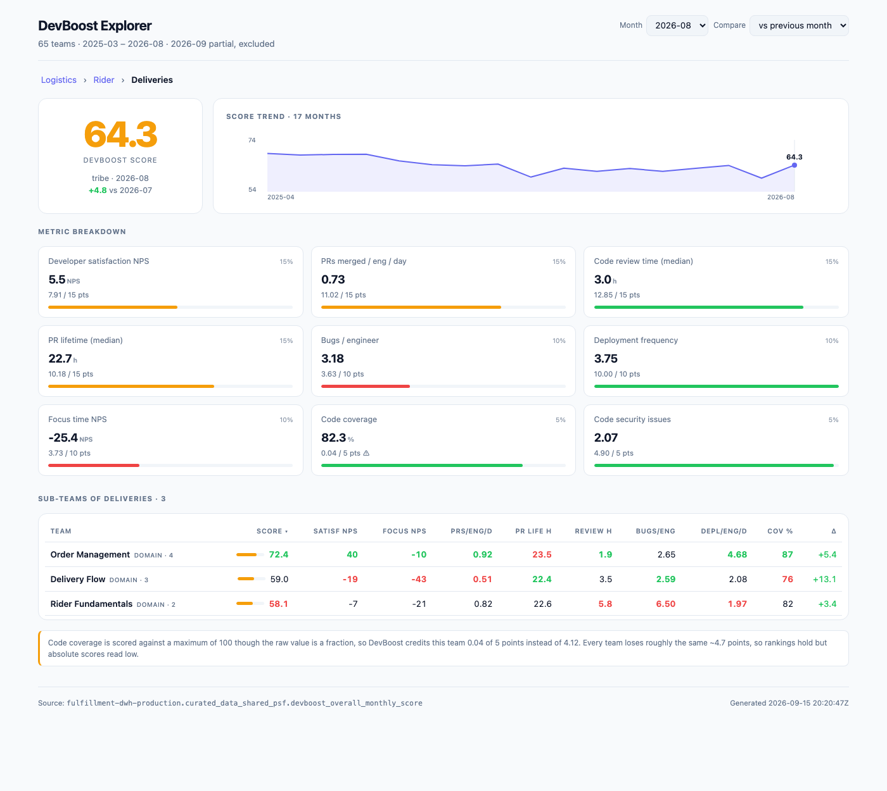
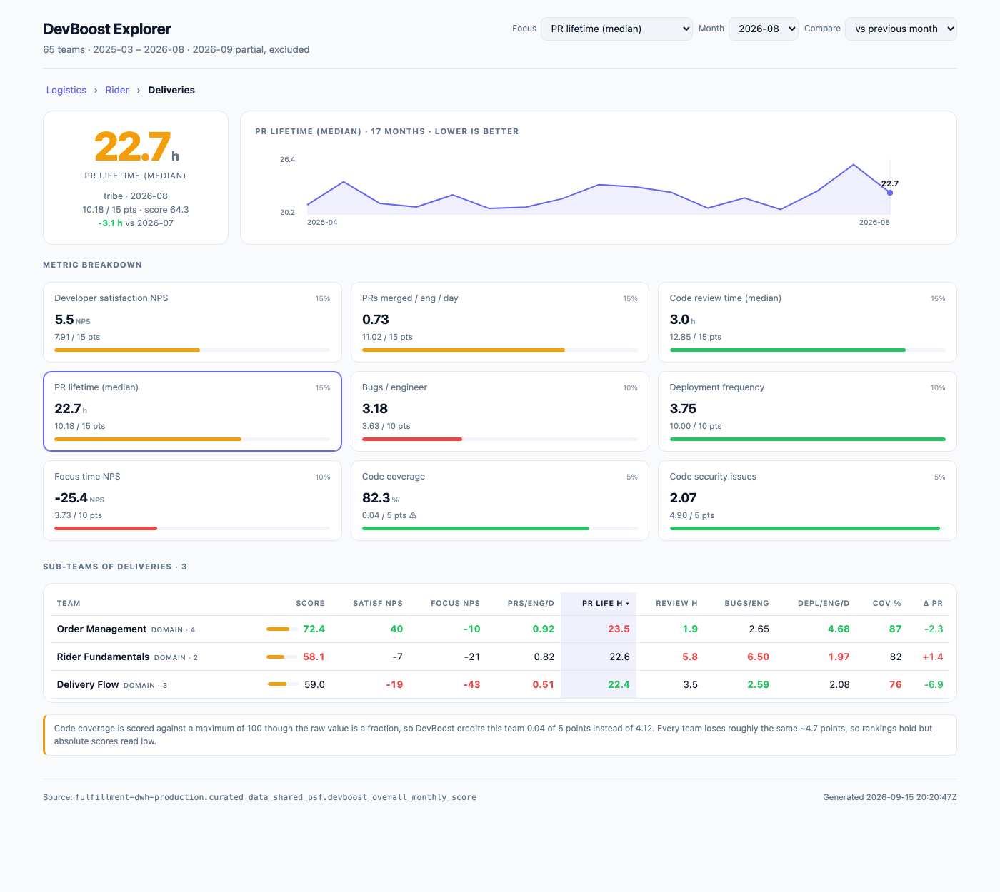

# DevBoost Explorer

Drill-down explorer for DevBoost scores across the Logistics org. Pick any team
from the platform root down to a squad, see its scorecard, and compare its
sub-teams side by side to find hot spots.



Focused on a single metric:



## Use it

```bash
./scripts/refresh.sh          # regenerate web/data/ from BigQuery
./scripts/refresh.sh --snapshot-only   # scores only, skip the slower repo map
cd web && python3 -m http.server 8787
open http://localhost:8787
```

Deep-link any team by group id, optionally with a focused metric:

```
index.html#group:log-deliveries
index.html#group:log-deliveries|pr_lifetime_hrs
```

## Focusing a metric

The Focus dropdown (or clicking any metric card) switches the whole view from
the overall score to a single metric. The hero shows that metric's raw value
with its points contribution and the team's overall score alongside; the delta
is in raw units and coloured by whether the move was an improvement, so a
falling PR lifetime reads green. The trend graph plots that metric, labelled,
with a dashed zero line where the scale crosses it (NPS does). The sub-team
table highlights and sorts by the focused column, and its Δ column follows.

Sorting always puts the best team first, so lower-is-better metrics sort
ascending. Click any header to re-sort or reverse.

## How it works

Two layers, deliberately separate so the UI can be repointed at another data
source (e.g. the Logistics prompt-delivery adoption tracker) without a rewrite:

| File | Role |
|---|---|
| `sql/snapshot.sql` | One query over the DevBoost table, all levels, Mar 2025 onward |
| `scripts/build_snapshot.py` | Reshapes rows into a nested tree keyed by `group_id` |
| `web/index.html` | Self-contained explorer; reads `data/snapshot.json`, no dependencies |
| `sql/repo_map.sql` | Which repos each squad owns, plus Codacy issue counts per repo |
| `scripts/build_repo_map.py` | Rolls those up the hierarchy and reconciles the sources |
| `sql/security_issues.sql` | The individual open Codacy findings, per month |
| `scripts/build_security_issues.py` | Packs them into the file the UI fetches on demand |

Source table: `fulfillment-dwh-production.curated_data_shared_psf.devboost_overall_monthly_score`

Queries are billed to `BILLING_PROJECT` (default `dhub-data-commune`) because
most people can read the table but cannot create jobs in its host project.

## The team → repo mapping

`refresh.sh` also writes a mapping of teams to the GitHub repos they own, at every
level of the hierarchy, with Codacy security-issue counts per repo:

| File | Contents |
|---|---|
| `web/data/repo-map-repos.csv` | one row per (team, repo) — 906 rows across 65 teams |
| `web/data/repo-map-summary.csv` | per team: repo count, Codacy coverage, issue totals |
| `web/data/repo-map-reconciliation.json` | where the three source systems disagree |

Repos attach to squads; a product line's set is the union of its squads'. Customer
Product Line owns 35 repos, the Logistics platform 181.

Nothing in the explorer reads these yet — they are a separate artifact, and a failed
repo-map query leaves the snapshot intact rather than breaking the refresh.

**Three populations, and they do not agree.** 37 squads are scored by DevBoost;
52 catalog squads own repos, and 16 of those have no DevBoost row at all (every Data
Science squad, `log-data-engineering`, `log-rider-payroll`, `log-routing-models`,
`log-payment-incentives`, `log-tech-council`, others). So 269 catalog repos reduce to
181 once placed in the hierarchy — the rest belong to teams DevBoost never scores.
148 of 275 registrations are analysed by Codacy at all; `in_codacy` separates "not
analysed" from "analysed and clean", which would otherwise both read as zero issues.

Severity is an inference, not a contract: Codacy's raw levels are High / Error /
Warning / Info, and the DevBoost report displays CRITICAL / MEDIUM. The mapping used
here (High+Error → CRITICAL, Warning → MEDIUM) was read off by comparing the table
against the report's own rendering for `logistics-pyosrm`.

## Open security issues

With **Code security issues** in focus, a collapsed panel at the foot of the page
lists the actual Codacy findings for the selected team and month — repo, severity,
message, and a link to the issue in Codacy. Filter by severity, 50 at a time.

The data (`web/data/security-issues.json`, ~790KB gzipped) is fetched only when the
panel is first expanded, so it costs nothing to anyone who does not open it.

Issues are keyed to each month's last weekly Codacy scan, so the list follows the
month selector. It is a point-in-time list rather than a monthly delta: an issue open
for six months appears in all six. Severity is Codacy's own — the official report
renders High and Critical alike, this does not.

## What the data does and doesn't say

**Scores are DevBoost's own, not recomputed.** Every hierarchy level
(PLATFORM / PRODUCT-LINE / TRIBE / DOMAIN / SQUAD) is published as its own row,
each recomputed upstream from raw events rather than averaged from its children.
A tribe's median PR lifetime is the true median across all its PRs, which cannot
be reconstructed from squad medians. So parent rows are read directly.

Verified: `overall_score` reproduces exactly from the normalized columns and the
[documented weights](https://deliveryhero.atlassian.net/wiki/spaces/techfoundations/pages/231211183/DevBoost+DevBoost+score)
across all 3,788 rows YTD, max difference 0.0.

**Code coverage is scored wrong upstream.** Raw `code_coverage` is a fraction
(0.82 = 82%), but normalization divides by a max of 100 instead of 1, so it lands
~100x low. Every team loses roughly 4.7 of 5 points, so rankings are unaffected
but absolute scores read low. The UI shows the real coverage bar and flags the
discrepancy. Note the official Looker Studio dashboard appears to apply the
correct scale, so the two disagree — worth raising with the pipeline owners.

**Missing metrics are imputed at 0.5.** A team with no source data for a metric
silently scores 50% on it. Rows where this happened are flagged in the UI. No
Logistics team was affected in the most recent month.

**Survey metrics are genuinely per-squad.** Developer satisfaction and focus
time NPS (25% of the composite combined) are quarterly, but they are not
inherited from the parent org — every squad carries a distinct value, so
squad-level comparison is valid across the full 100 points.

**Window is Mar 2025 – present.** The table starts March 2025; the org hierarchy
settled in June 2025. The current (incomplete) month is excluded from trends and
the month picker, since a partial month rendered next to full ones reads as a
drop that isn't real.

**Identity is `group_id`, not path.** Reorgs rewrite a team's display path while
its id stays stable, so trends key on id and labels come from the most recent
path. Where one path maps to several ids (a rename where the old id stopped
reporting), the longest-lived id wins. One pre-reorg node with no surviving
parent (`Logistics / Customer / Customer Logistics`, dead since May 2025) is
dropped.
